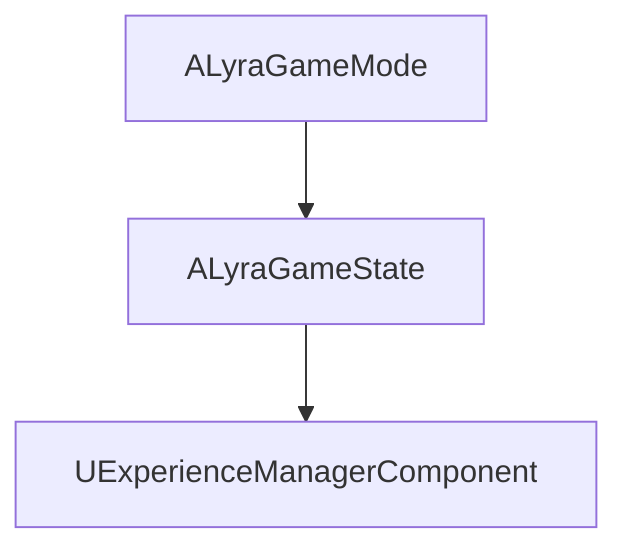
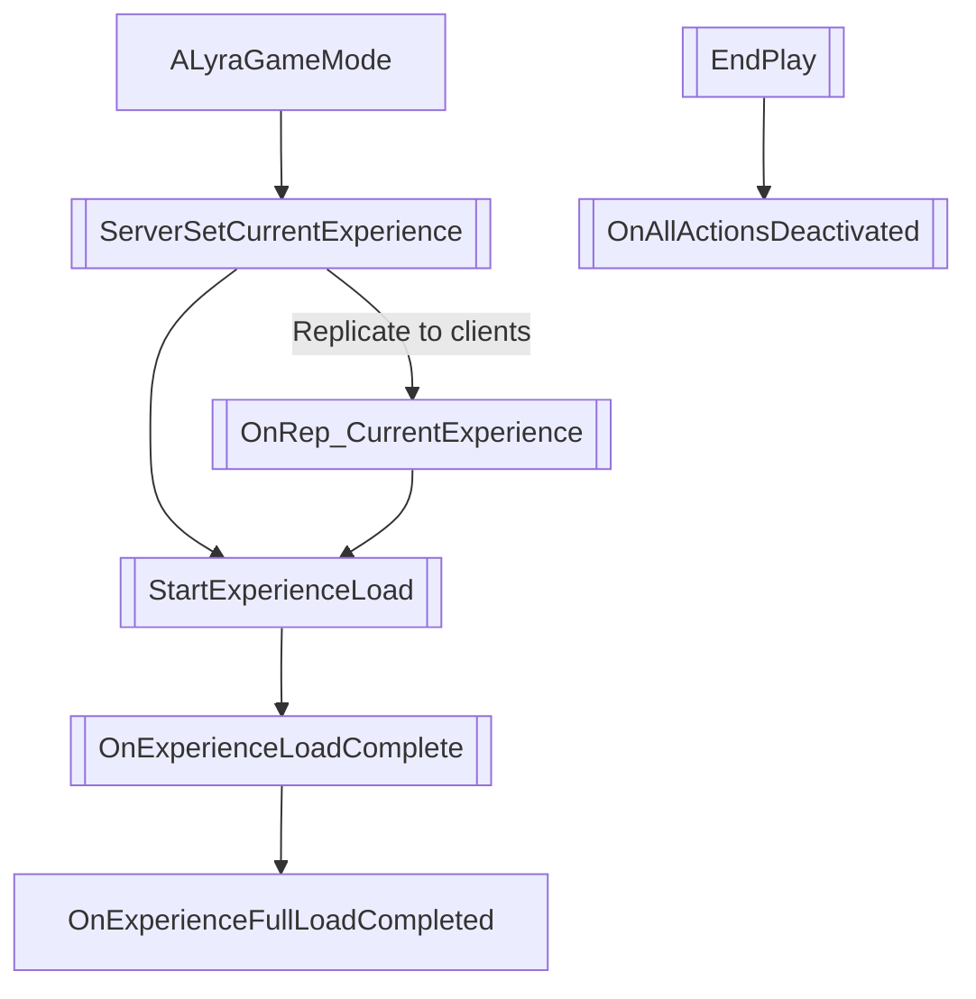
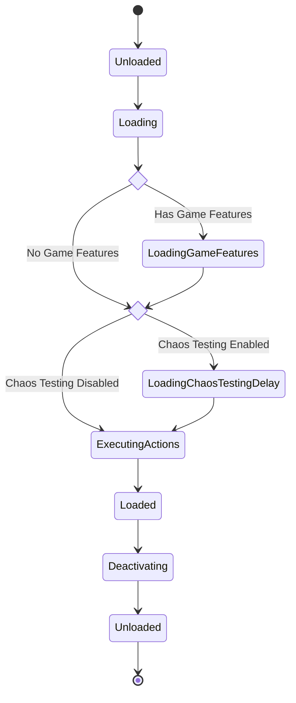

This is the third chapter in the [Lyra Deep Dive](https://unrealist.org/lyra-part-1/) series.

In the [previous chapter](https://unrealist.org/lyra-part-2/), we've learned about how experiences are defined. In this chapter, we'll take a deep dive into the lifecycle of an experience.

## Source Code
[View the source code for this chapter ❭](https://github.com/the-unrealist/lyra-deep-dive/tree/chapter3-experience-lifecycle)

I recommend looking at the [diff](https://github.com/the-unrealist/lyra-deep-dive/compare/chapter2-experiences...chapter3-experience-lifecycle) to see what's changed since the previous chapter.

## Lifecycle of an Experience
`ALyraGameState` automatically adds `UExperienceManagerComponent` to itself in its constructor. This component handles the entire lifecycle of an experience.



The lifecycle of an experience begins with `ALyraGameMode` on the server calling `ServerSetCurrentExperience` and replicating `CurrentExperience` to all clients.

The loading process starts immediately on the server. For clients, the loading process starts after `CurrentExperience` is replicated.



|Function|Target|Outcome|
|--------|------|-------|
|`ServerSetCurrentExperience`|Server|Set `CurrentExperience` which is replicated to all clients and call `StartExperienceLoad` on the server.|
|`OnRep_CurrentExperience`|Client|Call `StartExperienceLoad`|
|`StartExperienceLoad`|Client & Server|Load experience definition, associated assets, and asset bundles.|
|`OnExperienceLoadComplete`|Client & Server|Load and activate game feature plugins.|
|`OnExperienceFullLoadCompleted`|Client & Server|Execute game feature actions.|
||||
|`EndPlay`|Client & Server|Deactivate and unload game features.|
|`OnAllActionsDeactivated`|Client & Server|Clear `CurrentExperience`.|

The `LoadState` property reflects the current state of the experience. The following diagram shows the transition between states:



Let's take a closer look at each stage of the lifecycle.

## Replication
`ULyraExperienceManagerComponent` has a function `ServerSetCurrentExperience` that's available only in standalone or dedicated server builds.

```cpp
// File: LyraExperienceManagerComponent.h

#if WITH_SERVER_CODE
    void ServerSetCurrentExperience(FPrimaryAssetId ExperienceId);
#endif
```

```cpp
// File: LyraExperienceManagerComponent.cpp

#if WITH_SERVER_CODE
void ULyraExperienceManagerComponent::ServerSetCurrentExperience(FPrimaryAssetId ExperienceId)
{
    ULyraAssetManager& AssetManager = ULyraAssetManager::Get();
    FSoftObjectPath AssetPath = AssetManager.GetPrimaryAssetPath(ExperienceId);
    TSubclassOf<ULyraExperienceDefinition> AssetClass = Cast<UClass>(AssetPath.TryLoad());
    check(AssetClass);
    const ULyraExperienceDefinition* Experience = GetDefault<ULyraExperienceDefinition>(AssetClass);

    check(Experience != nullptr);
    check(CurrentExperience == nullptr);
    CurrentExperience = Experience;
    StartExperienceLoad();
}
#endif
```

In `ServerSetCurrentExperience`, the server does the following:

1. Synchronously load the experience *definition*.
2. Verify the experience definition was loaded successfully.
3. Set CurrentExperience which will trigger replication to all clients.
4. Call `StartExperienceLoad` to start the experience lifecycle on the server.

```cpp
// File: LyraExperienceManagerComponent.h

UPROPERTY(ReplicatedUsing=OnRep_CurrentExperience)
TObjectPtr<const ULyraExperienceDefinition> CurrentExperience;

UFUNCTION()
void OnRep_CurrentExperience();
```

```cpp
// File: LyraExperienceManagerComponent.cpp

void ULyraExperienceManagerComponent::OnRep_CurrentExperience()
{
    StartExperienceLoad();
}
```

`OnRep_CurrentExperience` is executed on all clients when `CurrentExperience` is replicated from the server. This function then calls `StartExperienceLoad` to start the experience lifecycle on the client.

## Stage 1: Load Experience Definition
The experience definition and all associated assets\* are asynchronously loaded in this stage.

Only assets that are directly referenced by the experience definition are loaded here like, for example, HUD widgets in the **Add Widgets** action. All other assets in game feature plugins are loaded in the next stage.

`StartExperienceLoad` begins by populating `BundleAssetList` with a set of primary asset IDs including the experience definition itself and any linked action sets.

```cpp
TSet<FPrimaryAssetId> BundleAssetList;

BundleAssetList.Add(CurrentExperience->GetPrimaryAssetId());
for (const TObjectPtr<ULyraExperienceActionSet>& ActionSet : CurrentExperience->ActionSets)
{
    if (ActionSet != nullptr)
    {
        BundleAssetList.Add(ActionSet->GetPrimaryAssetId());
    }
}
```

Next, it determines the [asset bundles](https://docs.unrealengine.com/5.1/en-US/asset-management-in-unreal-engine/#assetbundles) to load.

```cpp
TArray<FName> BundlesToLoad;
BundlesToLoad.Add(FLyraBundles::Equipped);

const ENetMode OwnerNetMode = GetOwner()->GetNetMode();
const bool bLoadClient = GIsEditor || (OwnerNetMode != NM_DedicatedServer);
const bool bLoadServer = GIsEditor || (OwnerNetMode != NM_Client);
if (bLoadClient)
{
    BundlesToLoad.Add(UGameFeaturesSubsystemSettings::LoadStateClient);
}
if (bLoadServer)
{
    BundlesToLoad.Add(UGameFeaturesSubsystemSettings::LoadStateServer);
}
```

|Asset Bundle Name|Purpose|Used By|
|-----------------|-------|-------|
|`Equipped`|Assets in this bundle are always loaded.|None (as of 5.1)|
|`Client`|Assets to load on clients or PIE.|HUD Widgets, Input Configs, and Ability Sets|
|`Server`|Assets to load on dedicated servers or PIE.|Input Configs and Ability Sets|

The assets and asset bundles are loaded with a call to `ChangeBundleStateForPrimaryAssets`. You may notice that the async handle for this operation, `BundleLoadHandle`, is then combined with `RawLoadHandle`. `LoadAssetList` loads all secondary assets added to `RawAssetList`. However, this is unused right now and you won't need it.

```cpp
const TSharedPtr<FStreamableHandle> BundleLoadHandle = AssetManager.ChangeBundleStateForPrimaryAssets(BundleAssetList.Array(), BundlesToLoad, {}, false, FStreamableDelegate(), FStreamableManager::AsyncLoadHighPriority);
const TSharedPtr<FStreamableHandle> RawLoadHandle = AssetManager.LoadAssetList(RawAssetList.Array(), FStreamableDelegate(), FStreamableManager::AsyncLoadHighPriority, TEXT("StartExperienceLoad()"));

// If both async loads are running, combine them
TSharedPtr<FStreamableHandle> Handle = nullptr;
if (BundleLoadHandle.IsValid() && RawLoadHandle.IsValid())
{
    Handle = AssetManager.GetStreamableManager().CreateCombinedHandle({ BundleLoadHandle, RawLoadHandle });
}
else
{
    Handle = BundleLoadHandle.IsValid() ? BundleLoadHandle : RawLoadHandle;
}

FStreamableDelegate OnAssetsLoadedDelegate = FStreamableDelegate::CreateUObject(this, &ThisClass::OnExperienceLoadComplete);
if (!Handle.IsValid() || Handle->HasLoadCompleted())
{
    // Assets were already loaded, call the delegate now
    FStreamableHandle::ExecuteDelegate(OnAssetsLoadedDelegate);
}
else
{
    Handle->BindCompleteDelegate(OnAssetsLoadedDelegate);

    Handle->BindCancelDelegate(FStreamableDelegate::CreateLambda([OnAssetsLoadedDelegate]()
    {
        OnAssetsLoadedDelegate.ExecuteIfBound();
    }));
}
```

Finally, when the async load operation is complete, it calls `OnExperienceLoadComplete` which brings us to the next stage.

At the end of `StartExperienceLoad`, certain assets may be preloaded without blocking the game. This is also unused at this time.

## Stage 2: Load Game Features
TODO
