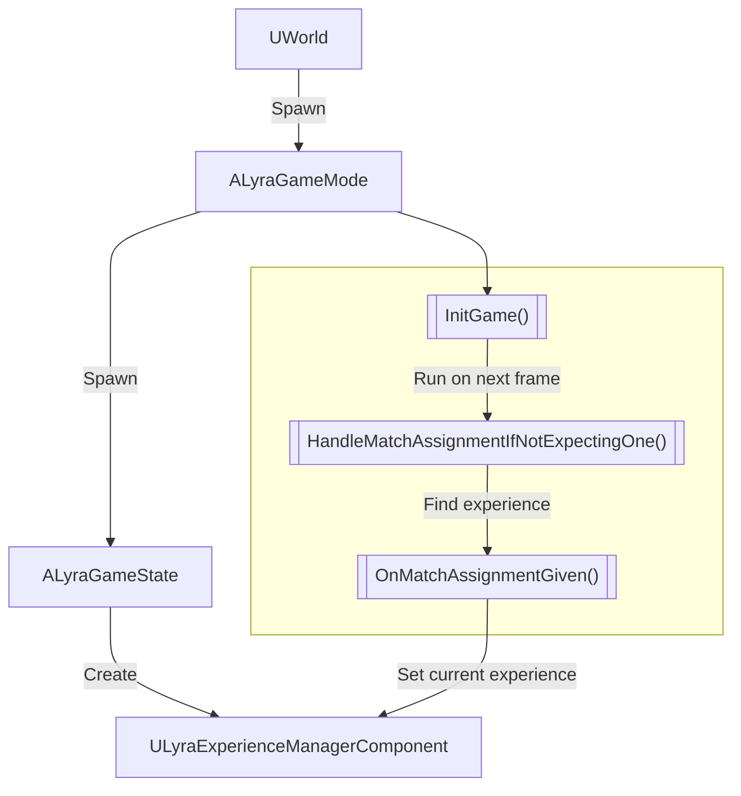

This is the **fourth** chapter in the [Lyra Deep Dive series](https://unrealist.org/lyra-part-1/).

We explored the lifecycle of an experience in the [previous chapter](https://unrealist.org/lyra-part-3/), but how does the game know *which* experience to load? In this chapter, we'll learn how an experience is selected.

## Lyra Deep Dive Series
<TODO: list>

## Experience Selection
I love flowcharts, so let's begin with one:

@startmermaid

@endmermaid

On the server (or a standalone game) when a level is loaded, the world spawns the game mode actor, `ALyraGameMode`, which then spawns the game state actor, `ALyraGameState`. The game state creates `ULyraExperienceManagerComponent` as an attached component.

After the world is loaded, it calls the `InitGame` method on the game mode. `ALyraGameMode` overrides this method to execute `HandleMatchAssignmentIfNotExpectingOne` in the next frame. This method handles the logic of selecting the initial experience to load for the current world.

There are many different ways to set the initial experience. Let's go through each one of them in order of precedence.

### 1. Matchmaking
TODO: CommonSession Subsystem (seems to set via URL options? Need to investigate how this works.. or maybe it's just removed from the code altogether?)

### 2. URL options
TODO: provide examples

### 3. Developer Settings
TODO: explain Lyra developer settings

### 4. Commandline Override
TODO: examples

### 5. World Settings
TODO: Lyra World Settings and how it's set in config

### 6. Dedicated Server
TODO: Brief explanation and link to next section for dedicated servers

### Fallback: Hardcoded Experience
TODO

## Dedicated Servers
TODO
